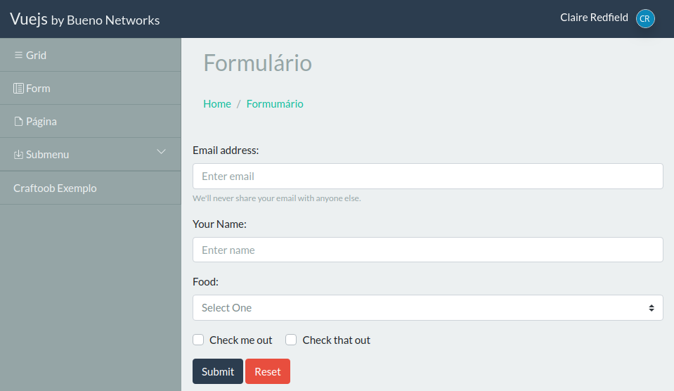

# BNW Plugins: Core

Este é o mecanismo de plugins, onde se encontram todas as funcionalidades necessárias para o desenvolvimento de aplicações SPA conectadas com o framework Laravel. 

> **Importante:** Este projeto está em desenvolvimento. Use-o por usa conta e risco!

## Arquitetura

Contendo um painel administrativo desenvolvido com [Vue.js](https://vuejs.org) para a camada de apresentação e com [Laravel](https://laravel.com) para a API, o `bnw/laravel-plugin-core` foi pensado para o desenvolvimento agilizado de aplicações SPA com framework Laravel, seguindo uma arquitetura baseada em plugins.

## O Painel Administrativo

Como já mencionado, a camada de apresentação consiste em um painel administrativo desenvolvido no formato Single Page Application (SPA).

Uma vez instalado o `bnw/laravel-plugin-core`, a rota '/admin' estará disponível, contendo a página html responsável pela renderização de um painel administrativo implementado como uma aplicação [Vue.js](https://vuejs.org).

Este painel é totalmente manipulável, podendo ser gerenciado tanto do lado do Frontend (dentro dos componentes dinâmicos do Vue.js) como do lado do Backend (dentro dos controladores do Laravel).

## Mais informações

- [Criando páginas](docs/paginas.md)
- [Manipulando o painel](docs/painel.md)
- [API Javascript](docs/api-js.md)
- [API PHP](docs/api-php.md)
- [Criando um plugin isolado](docs/plugin.md)

## Créditos

Orgulhosamente desenvolvido pela equipe da [Bueno Networks](http://www.buenonetworks.com.br)
